# dmn-event-listeners

Event Listeners for Decision Manager
- DMNTraceEventListener (DMN Event listener)

### Installing Event Listener Artifact

Go into the root directory, and install the Artifact.

   ```
   mvn clean install 
   ```

### DMNTraceEventListener
   
DMNEventListener is not enabled in DecisionManager by default and must be enabled.

1. For Demo Purposes, create a `Traffic Violation` project from the Decision Manager provided sample projects. Click the Caret right of 'Add Project' -> Try Sample -> Select `Traffic_Violation` -> Ok.

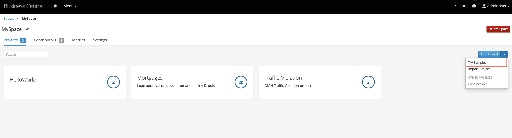
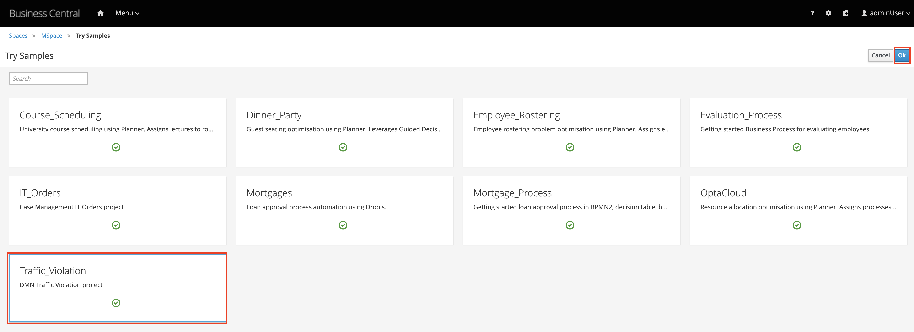

2. Add the Event Listeners project as a dependency. Inside Decision Manager, go to Traffic_Violation -> Settings -> Dependencies -> 'Add a Dependency'

Fill in the Values where needed:

- GroupId = `com.example.listeners`
- ArtifactId = `event-listeners`
- Version = `1.0.0-SNAPSHOT`

Check `Whitelist all Packages`

Save Settings

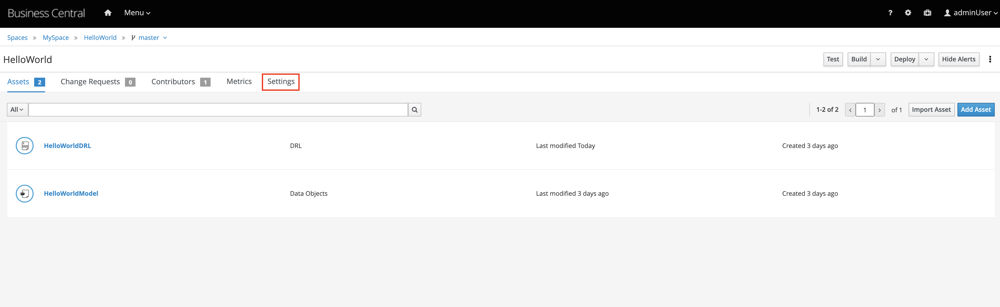
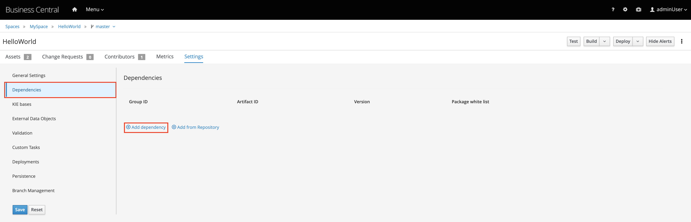


3. Add the DMNTraceEventListener Event Listener to the project. Inside settings for Traffic_Violation, go to -> Deployments -> Event listeners -> Add Event Listener.

Fill in Values:
- Name `com.example.listeners.DMNTraceEventListener`
- Resolver Type `Reflection`
- Done
- Save Settings

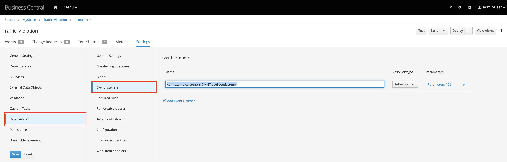

4. Enable DMNEventListener for this project by updating the kmodule.xml. 

-> Go to the `Traffic_Violation` project

-> Inside the project, click on any created asset (this can be a DRL, Data Bojects, or Test Scenario file that is ALREADY created inside the Traffic Violation project)

-> Click on the top left hand Caret underneath `Spaces`, Project explorer should come up.

-> Click the Settings icon (6 Options should come up - Project View, Repository View, Show as Links, etc.)

-> Click Repository View

-> Go to src/main/resources/META-INF/kmodule.xml

kmodule.xml should be edited and changed to:

    ```
    <kmodule xmlns="http://www.drools.org/xsd/kmodule" xmlns:xsi="http://www.w3.org/2001/XMLSchema-instance">
        <configuration>
            <property key="org.kie.dmn.runtime.listeners.mylistener" value="com.example.listeners.DMNTraceEventListener"/>
        </configuration>
    </kmodule>
    ```

-> Save the file

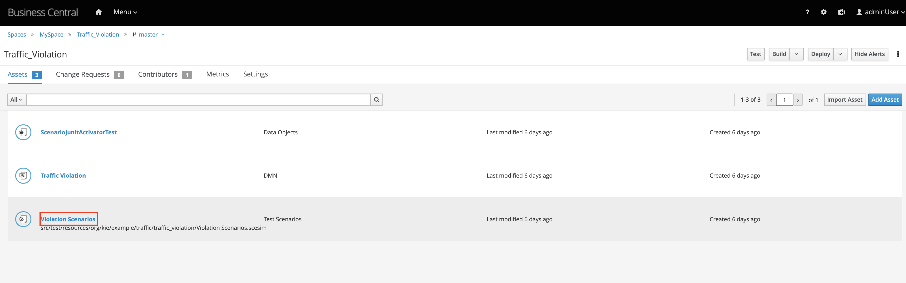

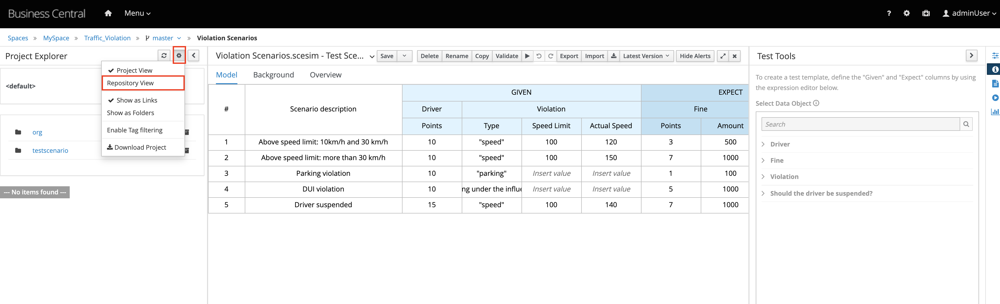
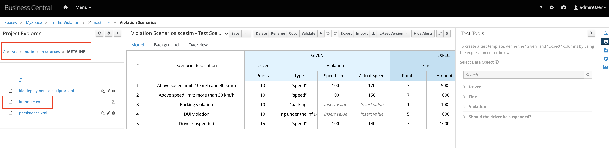
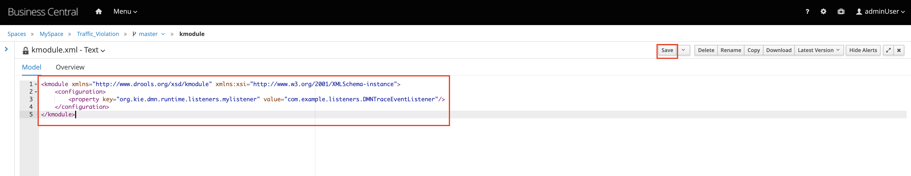

#### Testing

5. Deploy the Traffic Violation project

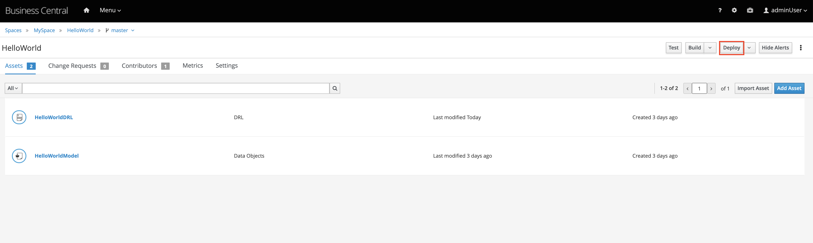

6. via REST API, send a CURL request to the KIE Server.

    Assuming kieserver:kieserver is the username and password with kieserver authorization.

    `username:password`

    ```
    curl -u kieserver:kieserver -X POST "http://localhost:8080/kie-server/services/rest/server/containers/traffic-violation_1.0.0-SNAPSHOT/dmn" -H "accept: application/json" -H "content-type: application/json" -d "{ \"model-namespace\" : \"https://github.com/kiegroup/drools/kie-dmn/_A4BCA8B8-CF08-433F-93B2-A2598F19ECFF\", \"model-name\" : \"Traffic Violation\", \"dmn-context\" : { \"Driver\" : { \"Points\" : 15 }, \"Violation\" : { \"Type\" : \"speed\", \"Actual Speed\" : 135, \"Speed Limit\" : 100 } }}"
    ```

    OR via Postman, send a POST request to the KIE Server

    ```
    URL: http://localhost:8080/kie-server/services/rest/server/containers/traffic-violation_1.0.0-SNAPSHOT/dmn

    Authorization: 
        Basic Auth
            Username: kieserver
            Password: kieserver

    Headers:
        Content-Type: application/json
        Accept: application/json
    
    Body:

       {
            "model-namespace": "https://github.com/kiegroup/drools/kie-dmn/_A4BCA8B8-CF08-433F-93B2-A2598F19ECFF",
            "model-name": "Traffic Violation",
            "dmn-context": {
                "Driver": {
                    "Points": 15
                },
                "Violation": {
                    "Type": "speed",
                    "Actual Speed": 135,
                    "Speed Limit": 100
                }
            }
        }  
    ```

7. View JBoss Logs to validate that the sample DMNTraceEventListener worked.
    ```
    15:24:33,443 INFO  [com.example.listeners.DMNTraceEventListener] (default task-9) beforeEvaluateDecision: BeforeEvaluateDecisionEvent{ name='Fine' id='_4055D956-1C47-479C-B3F4-BAEB61F1C929' }
    15:24:33,445 INFO  [com.example.listeners.DMNTraceEventListener] (default task-9) beforeEvaluateDecisionTable: BeforeEvaluateDecisionTableEvent{ nodeName='Fine' decisionTableName='Fine' }
    15:24:33,456 INFO  [com.example.listeners.DMNTraceEventListener] (default task-9) afterEvaluateDecisionTable: AfterEvaluateDecisionTableEvent{ nodeName='Fine' decisionTableName='Fine' matches=[2] fired=[2] }
    15:24:33,457 INFO  [com.example.listeners.DMNTraceEventListener] (default task-9) beforeEvaluateDecision: BeforeEvaluateDecisionEvent{ name='Should the driver be suspended?' id='_8A408366-D8E9-4626-ABF3-5F69AA01F880' }
    15:24:33,457 INFO  [com.example.listeners.DMNTraceEventListener] (default task-9) beforeEvaluateContextEntry: BeforeEvaluateContextEntryEventImpl{nodeName='Should the driver be suspended?', variableName='Total Points', variableId='_09385E8D-68E0-4DFD-AAD8-141C15C96B71', expressionId='_F1BEBF16-033F-4A25-9523-CAC23ACC5DFC'}
    15:24:33,459 INFO  [com.example.listeners.DMNTraceEventListener] (default task-9) afterEvaluateContextEntry: AfterEvaluateContextEntryEventImpl{nodeName='Should the driver be suspended?', variableName='Total Points', variableId='_09385E8D-68E0-4DFD-AAD8-141C15C96B71', expressionId='_F1BEBF16-033F-4A25-9523-CAC23ACC5DFC', expressionResult=22}
    15:24:33,459 INFO  [com.example.listeners.DMNTraceEventListener] (default task-9) beforeEvaluateContextEntry: BeforeEvaluateContextEntryEventImpl{nodeName='Should the driver be suspended?', variableName='__RESULT__', variableId='null', expressionId='_1929D813-B1C9-43C5-9497-CE5D8B2B040C'}
    15:24:33,460 INFO  [com.example.listeners.DMNTraceEventListener] (default task-9) afterEvaluateContextEntry: AfterEvaluateContextEntryEventImpl{nodeName='Should the driver be suspended?', variableName='__RESULT__', variableId='null', expressionId='_1929D813-B1C9-43C5-9497-CE5D8B2B040C', expressionResult=Yes}
    ```


## Troubleshooting

### Incorrect / Old Logging Results from Event Listener

If the expected result is not showing up on the logs after deploying the project and a POST request, the deployment may need to be deleted from the execution server and re-deployed.

-> Menu
-> Execution Servers
-> Deployment Unit being deleted
-> Stop
-> Remove
-> Re-deploy

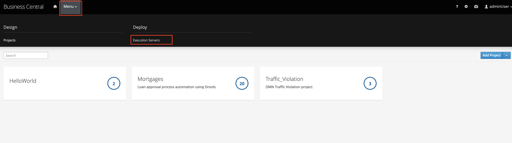
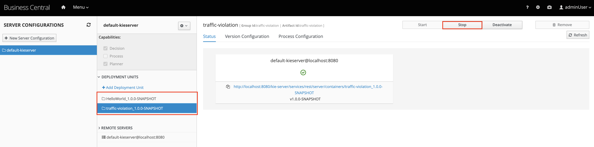
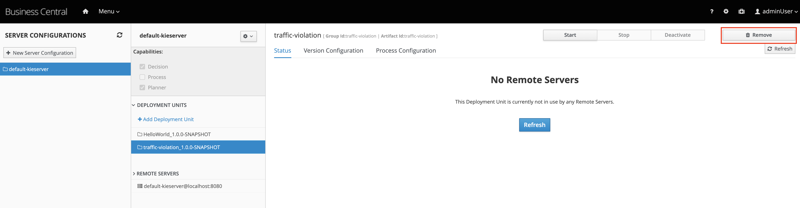
